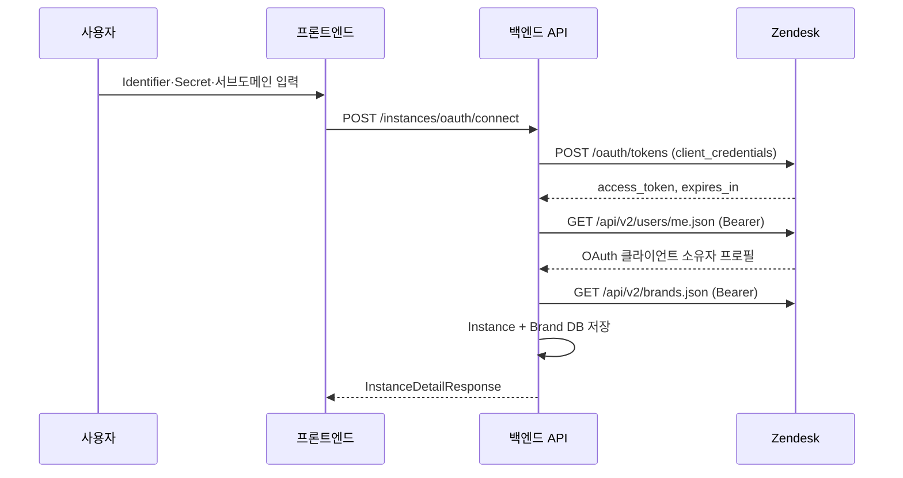

# Zendesk OAuth 인증 흐름 (Client Credentials)

`zd-article-migrator`는 **OAuth Client Credentials Grant**로 Zendesk API에 접근한다.  
사용자 동의 화면(브라우저 리다이렉트) 없이, 백엔드가 Admin Center에 등록한 **confidential OAuth 클라이언트**의 Identifier·Secret으로 access token을 발급한다.

관련 코드:

| 역할 | 파일 |
|------|------|
| OAuth 클라이언트 설정 검증·조합 | `services/zendesk_oauth_credentials.py` |
| 토큰 발급·만료 재발급·API 래퍼 | `services/zendesk_oauth_service.py` |
| HTTP 라우트(연결) | `api/routers/instances.py` |
| Bearer 헤더로 Zendesk 호출 | `services/zendesk_client.py` |

공식 문서:

- [Client credentials grant type](https://developer.zendesk.com/api-reference/ticketing/oauth/grant_type_tokens/#client-credentials-grant-type)
- [Using OAuth to authenticate API requests](https://developer.zendesk.com/documentation/api-basics/authentication/api-tokens-to-oauth/)

---

## 사전 준비 (Zendesk Admin Center)

각 Zendesk 인스턴스의 **Admin Center → Apps and integrations → Zendesk API → OAuth Clients**에서 **confidential** 클라이언트를 등록한다.

| 항목 | 설명 |
|------|------|
| **Identifier** | `oauth_client_id` |
| **Secret** | `oauth_client_secret` (서버에만 보관) |
| **Scope** | 기본 `read write` (`ZENDESK_OAUTH_SCOPES`로 변경 가능) |

**Redirect URI는 Client Credentials에서 사용하지 않는다.**

API 호출 권한은 **OAuth 클라이언트를 만든 Zendesk 사용자**와 동일하다. Help Center 이관 등에 필요한 권한·scope를 그 계정에 맞게 설정한다.

---

## 전체 흐름 요약



Authorization Code(동의 화면) 흐름은 사용하지 않는다.

---

## 연결 API — `POST /instances/oauth/connect`

**호출 주체:** 프론트엔드 (`apiClient.connectOAuth`)

**요청 본문 (`OAuthConnectRequest`):**

```json
{
  "subdomain": "mycompany",
  "oauth_client_id": "zendesk_admin_identifier",
  "oauth_client_secret": "zendesk_admin_secret",
  "oauth_scopes": "read write",
  "name": "내 Zendesk",
  "instance_id": null,
  "selected_brand_ids": []
}
```

| 경우 | 동작 |
|------|------|
| `instance_id` 없음 | 신규 Instance + Brand 생성 |
| `instance_id` 있음 | 기존 인스턴스 OAuth 재연결(토큰·클라이언트·이메일 갱신) |
| Secret 비어 있고 `instance_id` 있음 | DB에 저장된 Secret 사용 |

**백엔드 처리 순서:**

| 순서 | 처리 |
|------|------|
| 1 | `build_client_config()` — client_id/secret 검증 |
| 2 | `ZendeskOAuthService.exchange_client_credentials()` |
| 3 | `fetch_user_profile()` — 클라이언트 소유자 이메일 |
| 4 | 인스턴스 생성 또는 갱신 + 브랜드 저장(신규) |

**응답:** `InstanceDetailResponse`

---

## Zendesk Token Endpoint

```
POST https://{subdomain}.zendesk.com/oauth/tokens
Content-Type: application/json
```

```json
{
  "grant_type": "client_credentials",
  "client_id": "YOUR_CLIENT_ID",
  "client_secret": "YOUR_CLIENT_SECRET",
  "scope": "read write"
}
```

**성공 응답 예:**

```json
{
  "access_token": "...",
  "token_type": "bearer",
  "expires_in": 1800,
  "scope": "read write"
}
```

- **refresh_token 없음** — 만료 시 동일 요청으로 재발급
- `expires_in`이 없으면 DB에 만료 시각을 저장하지 않으며, 401/403 시에만 재발급

---

## 토큰 만료 및 재발급

### 1) 선제 재발급 (`ensure_valid_access_token`)

DB `oauth_token_expires_at`(Unix 초)이 있고, 현재 시각 + 120초 버퍼 이내로 만료되면 API 호출 전에 `client_credentials`로 재발급한다.

### 2) 401/403 재시도

Zendesk API가 401/403이면 `reissue_instance_access_token()` 후 **1회 재시도**한다.

`request_json`, `get_json`, `post_json`, `put_json`, `patch_json`, `delete`, `get_bytes`, `upload_attachment`, `get_brands` 모두 이 패턴을 따른다.

---

## 인증 후 Zendesk API 호출

```
Authorization: Bearer {access_token}
```

| 용도 | 메서드 | URL |
|------|--------|-----|
| OAuth 클라이언트 소유자 | GET | `/api/v2/users/me.json` |
| 브랜드 목록 | GET | `/api/v2/brands.json` |
| Help Center 등 | * | `/api/v2/help_center/...` |

---

## DB 저장 필드 (`instances` 테이블)

| 컬럼 | 설명 |
|------|------|
| `oauth_client_id` | Admin Center Identifier |
| `oauth_client_secret` | Admin Center Secret |
| `oauth_scopes` | scope 문자열 |
| `oauth_access_token` | Bearer access token |
| `oauth_token_expires_at` | access token 만료 Unix 초(문자열, 없으면 `""`) |
| `oauth_refresh_token` | 미사용(빈 문자열 유지, 하위 호환) |
| `oauth_redirect_uri` | 미사용(레거시 컬럼) |

`oauth_connected`는 `oauth_access_token`이 비어 있지 않을 때 `true`이다.

---

## 환경 변수

| 변수 | 기본값 | 설명 |
|------|--------|------|
| `ZENDESK_OAUTH_SCOPES` | `read write` | 공통 scope |

---

## 앱 API 엔드포인트

| 메서드 | 경로 | 설명 |
|--------|------|------|
| POST | `/instances/oauth/connect` | Client Credentials 연결 + 인스턴스 생성/갱신 |
| POST | `/instances/brands/preview` | 저장된 토큰으로 브랜드 미리보기 |

(제거됨: `/instances/oauth/authorize`, `/instances/oauth/complete`)

---

## 에러 처리 요약

| 상황 | 메시지 |
|------|--------|
| client_id/secret 누락 | Identifier/Secret 필요 |
| `invalid_client` | Identifier·Secret 확인 |
| confidential 클라이언트 아님 등 | 토큰 발급 거부 안내 |
| access_token 없음 | Zendesk 재연결 안내 |
| API 401/403 | 재발급 후 1회 재시도 |

---

## Authorization Code와의 차이 (참고)

| 항목 | Client Credentials (현재) | Authorization Code (이전) |
|------|---------------------------|---------------------------|
| 사용자 동의 화면 | 없음 | 필요 |
| refresh_token | 없음 | 있음 |
| 토큰 주체 | OAuth 클라이언트 생성자 | 동의한 사용자 |
| Redirect URI | 불필요 | 필수 |
